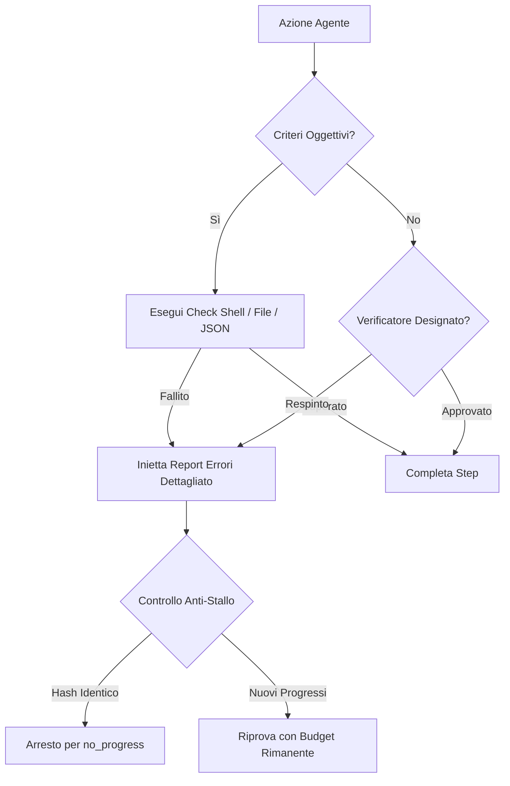

[](https://www.typescriptlang.org/)
[](https://nodejs.org/)
[](https://ollama.com/)
[](https://openrouter.ai/)
[](tests/)
[](LICENSE)
[](https://github.com/nispa/tsuka/pulls)

<br />

<div align="center">

```text
████████  ██████  ██    ██  ██    ██    ████
   ██    ██       ██    ██  ██   ██    ██  ██
   ██     ██████  ██    ██  ██████    ████████
   ██          ██ ██    ██  ██   ██   ██    ██
   ██    ██████    ██████   ██    ██  ██    ██
```

### **TypeScript Unified Kit for Agents**
*Framework multi-agente deterministico, ultra-leggero con CLI e TUI a schermo intero in TypeScript.*

[🇮🇹 Italiano](README-it.md) · [🇬🇧 Read in English](README.md) · [📚 Documentazione](docs/README-it.md) · [🌐 Wiki GitHub](https://github.com/nispa/tsuka/wiki)

</div>

---

**TSUKA** è un harness multi-agente didattico, deterministico e ultra-leggero con interfaccia interattiva CLI/TUI, interamente scritto in TypeScript. Si collega in modo trasparente a backend LLM locali (**Ollama**, **llama.cpp/llama-server**, **Unsloth Studio**, **LM Studio**) tramite endpoint standard compatibili con OpenAI (`/v1/chat/completions`) e a gateway cloud (**OpenRouter**).

> 🗡️ **Il nome**: 柄 (*tsuka*) è l'impugnatura della katana — il punto di presa a cui ogni lama si aggancia saldamente. I modelli LLM sono le lame; TSUKA è l'impugnatura che ti permette di brandirli con precisione, controllo e sicurezza.
>
> 💡 **Perché TSUKA?** La maggior parte dei sistemi multi-agente sono complessi, opachi e vincolati all'ecosistema Python/Linux. TSUKA porta un'orchestrazione agentica deterministica e trasparente su **Windows (PowerShell)**, **Linux** e **macOS** senza boilerplate, con tool auto-scoperti a caldo, memoria persistente e una ricca interfaccia terminale.

---

## ✨ Punti Salienti

| Caratteristica | Descrizione |
|---|---|
| 🖥️ **TUI Interattiva a Schermo Intero** | Interfaccia grafica da terminale (`tsuka --tui`): double-buffering differenziale a zero sfarfallio, supporto mouse SGR 1006, prompt multilinea elastico, visualizzatore file modale e ricerca live dei tool. |
| 📡 **Telemetria di Inferenza in Tempo Reale** | Elimina l'attesa alla cieca: monitora `⚡ PREFILL` (ingestione contesto KV Cache), `🌊 DECODE` (tok/s effettivi, prefill escluso), **TTFT** (*Time to First Token*) e logits di confidenza dei candidati latenti. |
| 👥 **Orchestrazione Multi-Agente** | Pianificazione autonoma di obiettivi (`/goal`), pipeline collaborative e round-robin (`/team`), e conferenze/dibattiti a più voci (`/call`). |
| 🔁 **Loop Verifica $\to$ Correzione** | Criteri di accettazione oggettivi (exit code di comandi, esistenza file, validità JSON) guidano ritentativi automatici con protezione anti-stallo. |
| 🧩 **Auto-Discovery dei Tool a Caldo** | Basta aggiungere un file `.ts` in `src/tools/impl/` per registrare nuovi tool all'avvio con zero configurazione manuale. |
| 🛠️ **Auto-Creazione dei Tool** | Gli agenti avanzati possono scrivere, testare in sandbox `node:vm` e registrare a caldo nuovi tool JavaScript (`create_tool`) durante la sessione. |
| 📊 **Capability Fingerprinting** | `/benchmark` valuta oggettivamente i modelli locali su 5 suite di test JSON, misurando l'effettiva precisione di tool calling senza tirare a indovinare dalla dimensione dei parametri. |
| 🧠 **Memoria Condivisa Persistente** | Memoria associativa veloce con ranking semantico a parole chiave (`memory.json`), condivisa tra tutti gli agenti e persistente tra i riavvii. |
| 🛡️ **Permessi di Sicurezza a 3 Livelli** | Rigida classificazione del rischio (`SAFE`, `RESTRICTED`, `DANGEROUS`), coda serializzata dei prompt utente, isolamento workspace jail e analisi statica SAST del codice (`audit_code`). |
| 💾 **Esportatore di Sessione Markdown** | I comandi `/export` e `/save` archiviano la sessione in file Markdown puliti con tracce di ragionamento collassabili e storico completo dei tool. |

---

## 📋 Indice

- [⚡ Guida Rapida in 60 Secondi](#-guida-rapida-in-60-secondi)
- [🚀 Installazione & Setup](#-installazione-e-setup)
- [🖥️ TUI Interattiva a Schermo Intero (Dashboard)](#️-tui-interattiva-a-schermo-intero-dashboard)
- [👥 Workflow Multi-Agente](#-workflow-multi-agente)
  - [Orchestratore Dinamico di Obiettivi (`/goal`)](#orchestratore-dinamico-di-obiettivi-goal)
  - [Team Collaborativi (`/team`)](#team-collaborativi-team)
  - [Conferenza & Dibattito (`/call`)](#conferenza--dibattito-call)
  - [Protocollo di Coordinamento & Lavagna di Run](#protocollo-di-coordinamento--lavagna-di-run)
- [🔁 Loop Verifica $\to$ Correzione & Anti-Stallo](#-loop-verifica--correzione--anti-stallo)
- [🧰 Catalogo dei Tool (27 Tool Nativi)](#-catalogo-dei-tool-27-tool-nativi)
  - [Auto-Creazione dei Tool (`create_tool`)](#auto-creazione-dei-tool-create_tool)
- [🛡️ Sicurezza & Permessi a 3 Livelli](#️-sicurezza--permessi-a-3-livelli)
- [📊 Benchmark & Fingerprinting dei Modelli](#-benchmark--fingerprinting-dei-modelli)
- [🛠️ Riferimento Comandi Slash REPL](#️-riferimento-comandi-slash-repl)
- [🏗️ Architettura & Concetti Chiave](#️-architettura--concetti-chiave)
- [🧪 Test & Validazione Automatica](#-test--validazione-automatica)
- [📚 Documentazione & Wiki](#-documentazione--wiki)
- [🗺️ Roadmap & Come Contribuire](#️-roadmap--come-contribuire)
- [📄 Licenza](#-licenza)

---

## ⚡ Guida Rapida in 60 Secondi

```bash
# 1. Clona il repository e installa le dipendenze
git clone https://github.com/nispa/tsuka.git
cd tsuka
npm install
npm run build
npm link             # Rende disponibile il comando globale `tsuka`

# 2. Inizializza il workspace con il roster di agenti base
tsuka init --preset core

# 3. Avvia l'interfaccia interattiva
npm run tui          # Dashboard grafica a schermo intero (o: tsuka --tui)
# Oppure la classica CLI REPL:
tsuka
```

> [!TIP]
> Assicurati che un server locale sia in esecuzione (es. `ollama serve`, `llama-server` o Unsloth Studio), oppure configura la tua `OPENROUTER_API_KEY` nel file `.env`.

---

## 🚀 Installazione e Setup

### 1. Prerequisiti

Avvia il tuo provider LLM locale o configura le chiavi cloud:

```powershell
# Opzione A: Ollama
ollama serve
ollama pull qwen2.5-coder:7b

# Opzione B: llama.cpp / llama-server
llama-server -m models/qwen2.5-coder-7b.gguf --port 8080

# Opzione C: Provider Cloud (OpenRouter)
echo "OPENROUTER_API_KEY=la_tua_chiave" >> .env
```

### 2. Installazione Globale del Comando (`tsuka`)

Esegui TSUKA da qualsiasi cartella in PowerShell, Bash o Zsh:

```powershell
npm run build
npm link             # Registra `tsuka` globalmente nel PATH di sistema
tsuka                # Avvia la REPL in qualunque directory
tsuka --tui          # Avvia la TUI a schermo intero ovunque
```

Dopo aver modificato il codice sorgente locale, aggiorna il binario con `npm run build`. Per disinstallare: `npm unlink -g tsuka`.

### 3. Inizializzazione Workspace (`tsuka init`)

Inizializza workspace dedicati per specifici progetti:

```powershell
tsuka init                         # Procedura guidata interattiva
tsuka init --preset core           # Roster essenziale (14 personaggi, 4 team)
tsuka init --preset full           # Roster completo (tutti i 24 personaggi, 21 ruoli, 10 team)
tsuka init --pack osint,devops     # Aggiunge pack specifici da presets/packs/
tsuka init --force                 # Sovrascrive una cartella .tsuka/ esistente
```

#### Workspace vs Cartella di Installazione

TSUKA risolve le risorse secondo una gerarchia rigorosa ([`src/core/apphome.ts`](src/core/apphome.ts)):
1. **Workspace `.tsuka/`**: Se presente nella cartella corrente, le impostazioni locali, i ruoli e la memoria del progetto hanno priorità.
2. **App Home Fallback**: In assenza di configurazione locale, fa riferimento alla directory globale di installazione (o a `$env:TSUKA_HOME`).
3. **Workspace Root Jail**: Tutte le operazioni sui file (`read_file`, `write_file`, `grep_search`) operano sempre in sicurezza all'interno della cartella di avvio.

---

## 🖥️ TUI Interattiva a Schermo Intero (Dashboard)

TSUKA include un'interfaccia a schermo intero ad alte prestazioni, sviluppata in ANSI nativo senza dipendenze pesanti:

```bash
npm run tui
# oppure:
tsuka --tui
```

```
┌─ TSUKA v0.5.1 ── [F1] Chat  [F2] Tools ─────────────────── [Ctx: 2,410 / 32,768 (7%)] ─┐
│ 📁 Explorer       │ 💬 Agente Attivo: @geordi (Developer)                              │
│ ├─ src/           │                                                                    │
│ │  ├─ core/       │ Utente: Crea un'utility per il calcolo dell'hash e testala.        │
│ │  └─ tools/      │                                                                    │
│ ├─ package.json   │ 🧠 Thinking: Pianificazione modulo di hashing...                   │
│ └─ tsuka.config   │ ⚡ [PREFILL 140 tok] 🌊 [DECODE 84.2 tok/s] [TTFT 120ms]           │
│                   │ 🛠️  write_file -> src/hasher.ts (SUCCESS)                         │
│ ⚡ Telemetria      │                                                                    │
│ Dec: 84.2 tok/s   │ Assistente: Creato src/hasher.ts con supporto SHA-256.             │
│ Conf: [████████░] │                                                                    │
├───────────────────┴────────────────────────────────────────────────────────────────────┤
│ > Esegui i test per verificare l'implementazione dell'hasher...                        │
└────────────────────────────────────────────────────────────────────────────────────────┘
```

### ⌨️ Scorciatoie da Tastiera & Controlli

| Tasto / Comando | Azione |
|---|---|
| `F1` / `F2` | Passa tra **Vista Chat** e **Catalogo / Cronologia Tool** |
| `F3` / `F4` | Apre i modali di selezione **Agente** / **Team** |
| `F5` / `F6` | Apre l'**Ispettore di Memoria** / Selettore **Modelli** |
| `F7` / `F12` | Cambia **Layout & Temi Colore** / Apre la **Guida Rapida Comandi** |
| `Shift+Enter` / `Ctrl+J` | Inserisce un a-capo nel box di input senza inviare il messaggio |
| `Esc` / `Ctrl+X` | Interrompe all'istante la generazione o il tool in corso (salvando il reasoning) |
| `→` / `←` / `Enter` | Naviga nell'albero dei file; premi `Enter` per aprire il **Visualizzatore File Modale** |
| `Space` o `i` | Inserisce il percorso del file evidenziato direttamente nel prompt |
| `Rotellina` / `Click` | Supporto mouse SGR 1006: scorre i pannelli, cambia tab, seleziona i file |

---

## 👥 Workflow Multi-Agente

TSUKA offre tre modalità operative multi-agente:

### Orchestratore Dinamico di Obiettivi (`/goal`)

Il comando `/goal` analizza l'obiettivo, seleziona autonomamente gli agenti più idonei tra tutti i personaggi registrati e ne coordina l'esecuzione:

```powershell
/goal Sviluppa un'API REST completa in Express, scrivi i test unitari e verifica le vulnerabilità di sicurezza.
```

1. **Pianificazione Autonoma**: L'orchestratore valuta le competenze di ciascun agente e genera un grafo di esecuzione con ordine sequenziale e blocchi `PARALLELO`.
2. **Esecuzione Guidata**: Ogni agente subentra al proprio turno, ispezionando i file creati dagli agenti nei passaggi precedenti.
3. **Supervisione & Verifica**: L'agente supervisore convalida gli esiti. Se i criteri non sono soddisfatti, lo step viene rimandato in lavorazione con le issue concrete.
4. **Resoconto Statistico di Performance**: Al termine mostra il consumo di token e tempi per ciascun agente:

```text
📊 RIEPILOGO STATS AGENTI
  Agente             Out tok    Ctx tok   Tot tok    Tempo    Velocità
  Geordi (Dev)          1420      12400     13820    14.2s   100.0 tok/s
  Worf (Sicurezza)       890      14500     15390     8.1s   109.8 tok/s
  Pike (Supervisore)     340      15800     16140     3.4s   100.0 tok/s
  ----------------------------------------------------------------------
  TOTALE                2650      15800     45350    25.7s   103.1 tok/s
```

### Team Collaborativi (`/team`)

Esegue team multi-agente preconfigurati (`teams/*.json`) per domini specifici:

```powershell
/team cyber_audit "Rafforza la configurazione SSH e cerca chiavi di accesso esposte nel repository"
```

| Modalità Strategia | Meccanica Operativa |
|---|---|
| `round-robin` | I membri intervengono a turno in ciclo fino alla risoluzione del compito. |
| `pipeline` | Flusso a catena di montaggio: ogni stazione rifinisce e arricchisce il lavoro della precedente. |
| `orchestrated` | Un orchestratore designato sceglie dinamicamente quale membro interviene al turno successivo. |
| `hybrid` | Aggiunge round formali di discussione e votazione (`discussionRounds > 0`) tra i cicli di esecuzione. |

### Conferenza & Dibattito (`/call`)

Avvia una tavola rotonda o un confronto a più voci tra agenti su qualsiasi quesito:

```powershell
/call @tuvok, @deanna_troi, @geordi "Dovremmo migrare il backend da REST a GraphQL?"
```

### Protocollo di Coordinamento & Lavagna di Run

- **Risoluzione del Protocollo**: Lo stato operativo è gestito prioritariamente via `tool_call` (`report_status`, `route_next`, `cast_vote`) $\to$ fallback su `marker testuali regex` $\to$ default di sicurezza. Qualsiasi degradazione viene segnalata a video e registrata nei log.
- **Lavagna di Sessione (`blackboard.ts`)**: Uno spazio di memoria scratchpad effimero isolato per ogni workflow tramite `AsyncLocalStorage`. Gli agenti possono scambiare note strutturate (`post_note`, `read_notes`) senza sovraccaricare il contesto chat primario.

---

## 🔁 Loop Verifica $\to$ Correzione & Anti-Stallo

Per evitare che i modelli si dichiarino completati senza aver verificato i risultati, TSUKA applica cancelli di validazione oggettivi:



1. **Accettazione Oggettiva**: Verifica exit code (`0`) di comandi di test, presenza di file o correttezza di schemi JSON.
2. **Verificatore Indipendente**: Validazione tra pari tramite `cast_vote` o `report_status`.
3. **Rilevamento Anti-Stallo**: Calcola l'hash delle risposte e dei file modificati per fermare tempestivamente i loop ripetitivi prima di esaurire il budget tentativi.

---

## 🧰 Catalogo dei Tool (27 Tool Nativi)

Ogni tool è implementato in TypeScript puro (`src/tools/impl/*.ts`) ed è accompagnato dal suo schema JSON compatibile con OpenAI (`tools_schemas/*.json`).

| Categoria | Tool Disponibili | Descrizione |
|---|---|---|
| 📁 **Filesystem** | `read_file`, `write_file`, `edit_file`, `delete_file`, `list_dir`, `grep_search` | Operazioni I/O su file confinate nella sandbox del workspace, con editing differenziale e scrittura a blocchi. |
| 💻 **Sistema** | `execute_command`, `get_ps_info` | Esecuzione comandi da shell (PowerShell/Bash multipiattaforma) con timeout e ispezione processi. |
| 🌐 **Web & Rete** | `web_search`, `browse_url`, `download_file` | Tracciamento deterministico delle fonti, estrazione Reader-View e download file. |
| 🧠 **Memoria** | `save_memory`, `recall_memory` | Salvataggio e recupero associativo di fatti ed esperienze tra sessioni. |
| 🤝 **Coordinamento** | `report_status`, `route_next`, `cast_vote`, `post_note`, `read_notes`, `send_message` | Protocollo strutturato di cooperazione multi-agente e lavagna condivisa. |
| 🧬 **Estensione** | `spawn_agent`, `switch_skill`, `create_role`, `create_tool` | Delega a sub-agenti, cambio ruolo dinamico e auto-creazione di nuovi tool. |
| ⚡ **Escalation** | `request_goal`, `request_team`, `request_call` | Escalation autonoma dei compiti con freno alla ricorsione infinita. |
| 🛡️ **Sicurezza SAST**| `audit_code` | Scanner statico per segreti (CWE-798), injection (CWE-78/89), XSS (CWE-79) e vulnerabilità crittografiche. |

### Auto-Creazione dei Tool (`create_tool`)

I modelli con profilo sufficiente (tier `MEDIUM` o `LARGE`) possono programmare e registrare nuovi tool a caldo:

```javascript
// Esempio di tool generato autonomamente da un agente:
create_tool({
  name: "count_lines",
  description: "Conta le righe totali in un file di testo",
  riskLevel: "SAFE",
  parameters: {
    type: "object",
    properties: { path: { type: "string" } },
    required: ["path"]
  },
  executeBody: "const content = require('fs').readFileSync(args.path, 'utf-8'); return 'Totale righe: ' + content.split('\\n').length;"
})
```

- **Validazione Sandbox**: Il codice JavaScript viene esaminato e validato in una sandbox isolata `node:vm`.
- **Backup di Sicurezza**: Prima di ogni eventuale sovrascrittura, i tool esistenti vengono salvati in `tools_backup/`.

---

## 🛡️ Sicurezza & Permessi a 3 Livelli

TSUKA adotta un modello di sicurezza a difesa in profondità:

```text
[ Richiesta Esecuzione Tool ]
              │
              ├── Tool SAFE ──────────────► Eseguito immediatamente
              │
              ├── Tool RESTRICTED ────────► Richiesta interattiva [y/N/sempre] per sessione
              │
              └── Tool DANGEROUS ─────────► Richiesta OBBLIGATORIA [y/N] (non bypassabile)
```

- **Jail del Workspace**: Blocca tutte le operazioni filesystem rigorosamente dentro `workspaceRoot` tramite `resolveSafePath()`, impedendo attacchi di path traversal (`..` o link simbolici).
- **Coda Serializzata dei Prompt**: Più agenti paralleli accodano le richieste di conferma in modo ordinato, evitando conflitti sul terminale.
- **Mascheramento Credenziali**: Rimuove automaticamente variabili d'ambiente sensibili (`API_KEY`, `SECRET`, `PASSWORD`, `TOKEN`) da log e prompt.

---

## 📊 Benchmark & Fingerprinting dei Modelli

Invece di basarsi sul nome del modello, TSUKA misura empiricamente le reali capacità del modello in uso:

```powershell
/benchmark           # Esegue il benchmark sul modello attualmente attivo
/benchmark all       # Esegue il benchmark su tutti i modelli presenti sul server
```

- **Test Set Oggettivi**: Esegue 5 suite di test dichiarative in [`benchmarks/`](benchmarks/) per verificare aderenza alle istruzioni, schemi JSON, chiamate a catena di tool e resistenza a distrattori.
- **Assegnazione Dinamica del Tier**:
  - `SMALL`: Set base (21 tool). I comandi da shell e i tool di escalation complessi vengono nascosti.
  - `MEDIUM` / `LARGE`: Accesso completo (27 tool), sblocca `create_tool`, `spawn_agent` ed esecuzione da riga di comando.

---

## 🛠️ Riferimento Comandi Slash REPL

| Comando Slash | Parametri | Descrizione |
|---|---|---|
| `/goal` | `<obiettivo>` | Orchestratore autonomo di obiettivi (pianificatore dinamico e supervisore). |
| `/team` | `[nome_team] ["compito"]` | Esegue un team o una pipeline multi-agente collaborativa. |
| `/call` | `[@agente1, @agente2] ["tema"]` | Avvia un dibattito o conferenza a tavola rotonda. |
| `/models` | `[id_modello]` | Elenca, cerca o cambia il modello LLM attivo. |
| `/provider` | `[ollama\|unsloth\|openrouter]` | Cambia il provider backend all'istante. |
| `/effort` | `[none\|low\|medium\|xhigh\|auto]` | Regola lo sforzo di ragionamento (budget CoT). |
| `/benchmark` | `[modello\|all]` | Esegue la suite di fingerprinting delle capacità. |
| `/agent` | `[nome_agente]` | Mostra o seleziona l'agente/personaggio attivo. |
| `/tools` | `[filtro]` | Ispeziona i tool abilitati, schemi e permessi. |
| `/export` | `[percorso_file]` | Esporta conversazione, CoT e log dei tool in Markdown. |
| `/stop` | — | Interrompe la generazione o il tool in corso (`Esc` / `Ctrl+X`). |
| `/continue` | `[id_traccia]` | Riprende un ragionamento interrotto senza ripartire da capo. |
| `/context` | — | Ispeziona il consumo token rispetto al budget di contesto. |
| `/memory` | `[clear\|<id>]` | Gestisce, legge o svuota la memoria condivisa persistente. |
| `/blackboard` | — | Visualizza note e stato dell'ultimo workflow eseguito. |
| `/runs` | — | Mostra lo storico e i report dettagliati dei workflow recenti. |
| `/copy` | — | Copia l'ultima risposta dell'assistente negli appunti. |
| `/reset` | — | Resetta la cronologia chat e le autorizzazioni di sicurezza. |
| `/help` | — | Mostra la guida con l'elenco dei comandi disponibili. |
| `/exit` | — | Chiude la sessione di TSUKA. |

---

## 🏗️ Architettura & Concetti Chiave

TSUKA adotta una separazione ortogonale tra identità, competenze ed esecuzione:

$$\text{Personaggio (Agente)} = \text{Ruolo (Competenze \& Tool)} \times \text{Tratto (Personalità \& Stile)}$$

```text
┌───────────────────────────────────────────────────────────────────┐
│                           TSUKA CORE                              │
│                                                                   │
│   CLI REPL (src/cli/)  ◄───►  Dashboard TUI (src/tui/)            │
│            │                               │                      │
│            └───────────────┬───────────────┘                      │
│                            ▼                                      │
│               Loop ReAct Agente (src/core/agent.ts)               │
│                            │                                      │
│         ┌──────────────────┼──────────────────┐                   │
│         ▼                  ▼                  ▼                   │
│   Provider LLM       Registry Tool      Manager Permessi          │
│   (OpenAI API)     (Auto-Scan a Caldo)  (Sicurezza a 3 Livelli)   │
│         │                  │                  │                   │
│         ▼                  ▼                  ▼                   │
│  Ollama / Unsloth     27 Tool Nativi    Jail del Workspace        │
└───────────────────────────────────────────────────────────────────┘
```

### Struttura del Progetto

```text
harness/
├── src/
│   ├── cli/             # Loop REPL CLI, streaming prompt, comandi
│   ├── tui/             # Dashboard grafica TUI (double-buffer, store, widget)
│   ├── core/            # Motore ReAct, provider LLM, memoria, budget contesto
│   ├── tools/           # Registry dinamico e 27 implementazioni native
│   └── safety/          # Manager permessi, jail workspace, coda prompt
├── characters/          # 24 Definizioni dei personaggi (ruoli + tratto associato)
├── roles/               # 21 Ruoli operativi (system prompt + tool autorizzati)
├── traits/              # 9 Tratti comportamentali (tono, stile, personalità)
├── teams/               # 10 Configurazioni di team preconfigurate
├── benchmarks/          # 5 Suite di test dichiarative in JSON
├── tools_schemas/       # 27 Schemi JSON per la validazione dei tool
└── tests/               # 65 suite di test automatizzati
```

---

## 🧪 Test & Validazione Automatica

TSUKA dispone di una suite completa di 65 file di test automatizzati con oltre 1.200 asserzioni:

```powershell
# Esegue l'intera suite di test
npm test

# Esegue singoli file di test
npx tsx tests/test_roles.ts
npx tsx tests/test_memory.ts
npx tsx tests/test_fingerprinting.ts
npx tsx tests/test_self_authoring.ts
npx tsx tests/test_goal_orchestrator.ts
```

> [!NOTE]
> Tutti i test unitari e di integrazione vengono eseguiti in modo isolato ed ermetico tramite mock provider (`MockLLMProvider`) e memorie temporanee, senza richiedere connessione a Internet e senza modificare lo stato reale dell'utente.

---

## 📚 Documentazione & Wiki

Consulta le guide di approfondimento disponibili nella cartella [`docs/`](docs/):

| Guida | Descrizione |
|---|---|
| 📖 [Portale Documentazione](docs/README-it.md) | Indice centrale e panoramica dell'architettura. |
| 🏛️ [Architettura Dettagliata](docs/architecture-it.md) | Approfondimento su assemblaggio prompt, loop ReAct e budget token. |
| 👥 [Guida Multi-Agente](docs/multi-agent-it.md) | Specifiche operative dettagliate per i workflow `/goal`, `/team` e `/call`. |
| 🛡️ [Specifiche di Sicurezza](docs/security-it.md) | Livelli di permesso, jail del filesystem e audit statico AST. |
| 🎯 [Casi d'Uso & Ricette](docs/use-cases-it.md) | Esempi pratici per sviluppo software, DevOps e audit di sicurezza. |
| 🎓 [Guida Didattica](docs/guida-didattica.md) | Tutorial passo-passo: costruire un harness agentico da zero. |

> La [Wiki GitHub](https://github.com/nispa/tsuka/wiki) viene generata automaticamente a partire da questi file tramite il comando `npm run wiki:build`.

---

## 🗺️ Roadmap & Come Contribuire

### Prossimi Obiettivi
- [x] TUI interattiva a schermo intero a zero sfarfallio (v0.5.1).
- [x] Telemetria di inferenza reale con tracking prefill e decode.
- [x] Capability fingerprinting empirico e benchmark JSON.
- [ ] Streaming diretto dell'output dei tool custom in sandbox.
- [ ] Portale web di visualizzazione e ispettore del grafo delle tracce agente.
- [ ] Integrazione tool basati su protocollo LSP (Language Server Protocol).

### Come Contribuire

I contributi e le Pull Request sono sempre benvenuti!
1. **Aggiungere Tool**: Crea `src/tools/impl/<tool>.ts` e `tools_schemas/<tool>.json`.
2. **Aggiungere Personaggi**: Crea semplici file JSON in `characters/`, `roles/`, `traits/` o `teams/`.
3. **Verificare i Test**: Assicurati che tutte le 65 suite di test passino con esito positivo (`npm test`).

---

## 📄 Licenza

Questo progetto è distribuito con [Licenza MIT](LICENSE) — libero per uso educativo, personale e commerciale.
