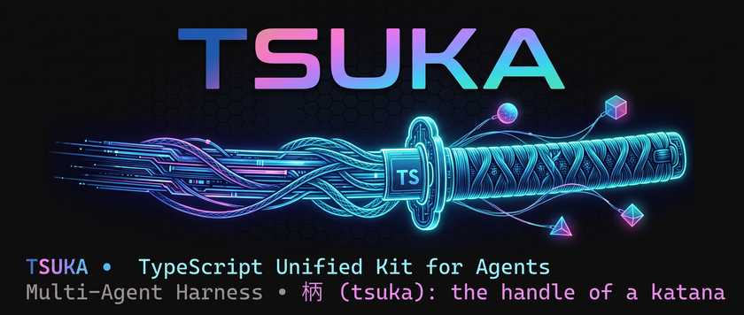

[](https://www.typescriptlang.org/)
[](https://nodejs.org/)
[](https://ollama.com/)
[](https://openrouter.ai/)
[](tests/)
[](LICENSE)
[](https://github.com/nispa/tsuka/pulls)

<br />

<div align="center">



### **TypeScript Unified Kit for Agents**
*Harness multi-agente deterministico, trasparente con CLI e TUI a schermo intero in TypeScript.*

[🇮🇹 Italiano](README-it.md) · [🇬🇧 Read in English](README.md) · [📚 Wiki Didattico](docs/README-it.md)

</div>

---

**TSUKA** è un harness multi-agente deterministico, didattico e ultra-leggero, scritto interamente in TypeScript puro. Si collega a backend LLM locali (**Ollama**, **llama.cpp**, **Unsloth Studio**, **LM Studio**) e gateway cloud (**OpenRouter**) tramite un'interfaccia standard compatibile con OpenAI (`/v1/chat/completions`).

> 🗡️ **Il nome**: 柄 (*tsuka*) è l'impugnatura della katana — il punto di presa solido a cui ogni lama si aggancia. I modelli LLM sono le lame intercambiabili; TSUKA è l'impugnatura che ti garantisce il controllo deterministico sulla loro esecuzione.
>
> 🎓 **Perché TSUKA?** La maggior parte dei framework multi-agente sono "scatole nere" pesanti, opache e vincolate a Python. TSUKA è concepito come un **laboratorio didattico trasparente**: zero magia, zero dipendenze da database vettoriali esterni, codice di controllo 100% deterministico ed esecuzione nativa di prima classe su **Windows (PowerShell)**, **Linux** e **macOS**.

---

## ✨ Punti Salienti dell'Architettura

| Pilastro | Design Architetturale & Valore |
|---|---|
| 🎯 **Determinismo Puro & Zero Magia** | L'LLM ragiona e propone chiamate a tool; l'harness governa rigorosamente lo stato, l'esecuzione, i limiti anti-loop (max 15 round) e i permessi. |
| 🪟 **Vero Cross-Platform Nativo** | Supporto di prima classe per Windows (PowerShell nativa senza bisogno di WSL o Python), macOS e Linux. |
| 🖥️ **TUI Interattiva a Schermo Intero** | Dashboard terminale zero-flicker a doppio buffer (`tsuka --tui`) con supporto mouse SGR 1006, schede e file explorer del workspace. |
| 🧠 **Memoria Persistente a Zero Dipendenze** | Ricerca per parole chiave BM25, stemming morfologico, deduplica alla scrittura ed emivita temporale in TypeScript puro (`memory.json`). |
| 🧩 **Auto-Discovery Dinamica dei Tool** | Basta rilasciare un file `.ts` in `src/tools/impl/` per registrarlo a caldo all'avvio con validazione JSON Schema automatica. |
| 🛠️ **Creazione Dinamica di Tool in Sandbox** | Gli agenti possono scrivere, testare in sandbox (`node:vm`) e caricare a caldo nuovi tool durante l'esecuzione per risolvere problemi imprevisti. |
| 👥 **Orchestrazione Multi-Agente** | Pianificazione autonoma di obiettivi (`/goal`), sandbox di staging parallele (`PARALLELO`), team preconfigurati (`/team`) e dibattiti a tavola rotonda (`/call`). |
| 📊 **Capability Fingerprinting** | Benchmark empirico (`/benchmark`) che misura l'accuratezza di tool-calling dei modelli piccoli per calibrare dinamicamente i tool attivi. |
| 🛡️ **Sicurezza a 3 Livelli di Permessi** | Workspace jail rigoroso (`resolveSafePath`), coda serializzata di conferme utente, mascheramento credenziali e analisi statica del codice (SAST). |

---

## ⚡ Guida Rapida

```bash
git clone https://github.com/nispa/tsuka.git
cd tsuka
npm install
npm run build
npm link                 # Rende disponibile il comando globale `tsuka`

tsuka init --preset core # Inizializza il workspace con il roster di base
npm run tui              # Avvia la TUI a schermo intero (o: tsuka --tui)
# Oppure la classica CLI REPL:
tsuka
```

> [!TIP]
> Assicurati che un backend locale sia attivo (`ollama serve`, `llama-server`, Unsloth Studio) oppure inserisci `OPENROUTER_API_KEY` nel file `.env`.

---

## 🚀 Installazione & Setup

```powershell
# Opzione A: Ollama (Consigliato per modelli locali 7B–14B)
ollama serve && ollama pull qwen2.5-coder:7b

# Opzione B: llama.cpp
llama-server -m models/qwen2.5-coder-7b.gguf --port 8080

# Opzione C: OpenRouter (Cloud)
echo "OPENROUTER_API_KEY=la_tua_chiave" >> .env
```

```powershell
npm run build
npm link               # Registra `tsuka` a livello globale
tsuka --tui            # Avvia la dashboard a schermo intero
```

Inizializza workspace dedicati con roster specifici:

```powershell
tsuka init                         # Procedura guidata interattiva
tsuka init --preset core           # Roster essenziale (14 personaggi, 4 team)
tsuka init --preset full           # Roster completo (24 personaggi, 21 ruoli, 10 team)
tsuka init --pack osint,devops     # Aggiunge pack dedicati
```

---

## 👥 Workflow Multi-Agente

- **`/goal <obiettivo>`** — Scompone dinamicamente obiettivi complessi in pipeline multi-agente con esecuzione parallela isolata e verifica da parte del supervisore.
- **`/team [nome] ["task"]`** — Esegue team preconfigurati (`teams/*.json`) attraverso 4 modalità collaborative (`round-robin`, `pipeline`, `orchestrated`, `hybrid`).
- **`/call [@a, @b] ["argomento"]`** — Dibattito strutturato a tavola rotonda tra molteplici personaggi specializzati.

Il coordinamento si basa su tool di protocollo deterministici (`report_status`, `route_next`, `cast_vote`) supportati da una lavagna effimera isolata (`AsyncLocalStorage`).

> 📚 Documentazione completa: [Guida Multi-Agente](docs/multi-agent-it.md)

---

## 🧰 Tool Nativi & Sicurezza

TSUKA include **30 tool nativi** (`src/tools/impl/*.ts`) suddivisi per area:
* **Filesystem**: `read_file`, `write_file`, `edit_file`, `delete_file`, `list_dir`, `grep_search` (strettamente confinati nel workspace jail).
* **Sistema**: `execute_command` (esecuzione shell cross-platform con conferma interattiva).
* **Memoria**: `save_memory`, `recall_memory`, `update_memory`, `forget_memory` (algoritmo BM25 + decadimento ad emivita).
* **Coordinamento**: `post_note`, `read_notes`, `report_status`, `route_next`, `cast_vote`.
* **Estensione & SAST**: `create_tool` (isolato in `node:vm`), `audit_code` (analizzatore statico di vulnerabilità di sicurezza CWE).

> 📚 Approfondimenti: [Specifica di Sicurezza](docs/security-it.md) · [Architettura di Sistema](docs/architecture-it.md)

---

## 🛠️ Comandi Slash della REPL

| Comando | Descrizione |
|---|---|
| `/goal <obiettivo>` | Orchestratore autonomo di obiettivi multi-agente. |
| `/team [nome] ["task"]` | Pipeline collaborativa per team predefiniti. |
| `/call [@a, @b] ["tema"]` | Dibattito a tavola rotonda tra più agenti. |
| `/models [id]` `/provider [p]` | Cambia modello attivo o backend LLM. |
| `/benchmark [model|all]` | Capability fingerprinting per function calling. |
| `/agent [nome]` `/tools [filtro]` | Ispeziona o seleziona personaggio / tool attivi. |
| `/export [path]` | Esporta conversazione e traccia dei tool in Markdown. |
| `/memory [clear|id]` `/blackboard` | Ispezione memoria persistente e lavagna di workflow. |
| `/stop` `/continue` `/reset` `/help` `/exit` | Controllo del ciclo di vita della sessione. |

---

## 📚 Wiki Didattico & Architettura

TSUKA è nato come strumento didattico aperto per comprendere il funzionamento concreto degli harness agentici affrontando le reali sfide ingegneristiche:

* 🧠 [**Sistema di Memoria Persistente**](docs/memory-it.md) — I 3 livelli di stato, la scala della memoria, algoritmo BM25 ed emivita.
* 🏛️ [**Architettura di Sistema**](docs/architecture-it.md) — ReAct loop, gestione del budget di contesto e disaccoppiamento I/O.
* 🎓 [**Guida Didattica: Costruire un Harness**](docs/guida-didattica.md) — 10 tappe per costruire un harness da zero e le 10 insidie reali.
* 👥 [**Workflow Multi-Agente**](docs/multi-agent-it.md) — Coordinamento dei team, tool di protocollo e staging parallelo.
* 📊 [**Capability Fingerprinting**](docs/benchmark-it.md) — Misurare l'affidabilità dei modelli locali sul function calling.
* 🛡️ [**Sicurezza & Permessi**](docs/security-it.md) — Confinamento del workspace, livelli di rischio e sandboxing.

---

## 📜 Licenza

MIT © [TSUKA Contributors](LICENSE)
