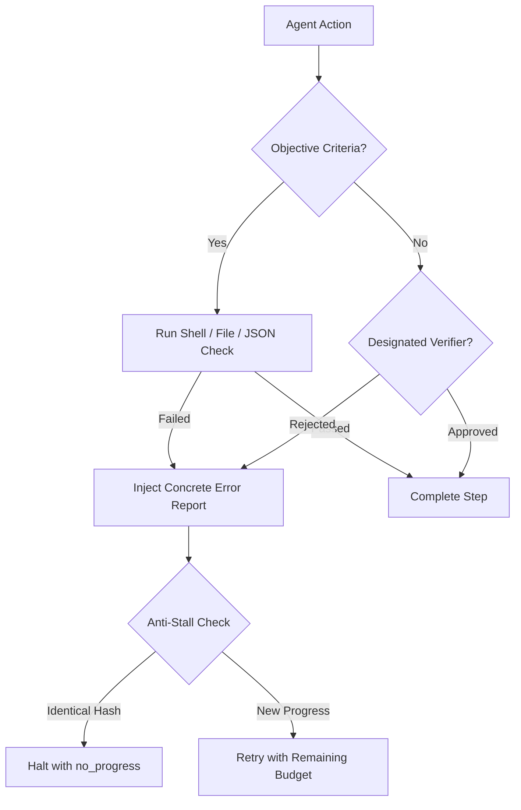

[](https://www.typescriptlang.org/)
[](https://nodejs.org/)
[](https://ollama.com/)
[](https://openrouter.ai/)
[](tests/)
[](LICENSE)
[](https://github.com/nispa/tsuka/pulls)

<br />

<div align="center">

```text
████████  ██████  ██    ██  ██    ██    ████
   ██    ██       ██    ██  ██   ██    ██  ██
   ██     ██████  ██    ██  ██████    ████████
   ██          ██ ██    ██  ██   ██   ██    ██
   ██    ██████    ██████   ██    ██  ██    ██
```

### **TypeScript Unified Kit for Agents**
*Deterministic, ultra-lightweight multi-agent CLI & full-screen TUI harness in TypeScript.*

[🇬🇧 English](README.md) · [🇮🇹 Leggi in Italiano](README-it.md) · [📚 Documentation](docs/README.md) · [🌐 GitHub Wiki](https://github.com/nispa/tsuka/wiki)

</div>

---

**TSUKA** is a deterministic, lightweight multi-agent harness and interactive CLI/TUI written entirely in TypeScript. It connects seamlessly to local LLM engines (**Ollama**, **llama.cpp/llama-server**, **Unsloth Studio**, **LM Studio**) via standard OpenAI-compatible endpoints (`/v1/chat/completions`) and cloud gateways (**OpenRouter**).

> 🗡️ **The name**: 柄 (*tsuka*) is the katana's hilt — the foundational grip where every blade mounts. Your models are the blades; TSUKA is the harness that lets you wield them with precision and safety.
>
> 💡 **Why TSUKA?** Most multi-agent systems are heavy, opaque, Python/Linux-centric frameworks. TSUKA brings deterministic, inspectable agentic orchestration to **Windows (PowerShell)**, **Linux**, and **macOS** with zero boilerplate, hot-pluggable tools, persistent memory, and a rich terminal interface.

---

## ✨ Key Highlights

| Feature | Description |
|---|---|
| 🖥️ **Interactive Full-Screen TUI** | Dual-mode interface (`tsuka --tui`): differential double-buffering, SGR 1006 mouse wheel/click support, elastic multiline prompt, file viewer modal, and live tool filtering. |
| 📡 **Real-Time Inference Telemetry** | Eliminates blind waiting: displays live `⚡ PREFILL` (KV context ingestion), `🌊 DECODE` (measured tok/s, prefill excluded), **TTFT** (*Time to First Token*), and latent candidate logits. |
| 👥 **Multi-Agent Orchestration** | Autonomous goal planning (`/goal`), collaborative pipelines and round-robins (`/team`), and multi-agent conference debates (`/call`). |
| 🔁 **Verify $\to$ Correct Loop** | Objective acceptance gates (exit codes, file existence, JSON schema) drive automated retries with anti-stall detection. |
| 🧩 **Hot-Plug Auto-Discovery** | Drop any `.ts` file into `src/tools/impl/` to auto-register native tools at boot with zero configuration. |
| 🛠️ **Self-Authoring Tools** | Capable agents can author, test in a `node:vm` sandbox, and hot-register brand-new JavaScript tools (`create_tool`) on the fly. |
| 📊 **Capability Fingerprinting** | `/benchmark` evaluates local models across 5 JSON test suites to measure actual tool-calling precision rather than guessing by parameter size. |
| 🧠 **Persistent Shared Memory** | Fast keyword-scored associative memory (`memory.json`) shared across agents and surviving across sessions. |
| 🛡️ **3-Tier Permission Model** | Strict risk classification (`SAFE`, `RESTRICTED`, `DANGEROUS`), serialized user prompts, workspace jail protection, and static code audit (`audit_code`). |
| 💾 **Markdown Session Exporter** | `/export` or `/save` exports clean Markdown logs with collapsible reasoning traces and formatted tool execution history. |

---

## 📋 Table of Contents

- [⚡ Quickstart in 60 Seconds](#-quickstart-in-60-seconds)
- [🚀 Installation & Setup](#-installation--setup)
- [🖥️ Interactive Terminal UI (TUI Dashboard)](#️-interactive-terminal-ui-tui-dashboard)
- [👥 Multi-Agent Workflows](#-multi-agent-workflows)
  - [Dynamic Goal Orchestrator (`/goal`)](#dynamic-goal-orchestrator-goal)
  - [Collaborative Teams (`/team`)](#collaborative-teams-team)
  - [Conference Debate (`/call`)](#conference-debate-call)
  - [Coordination Protocol & Blackboard](#coordination-protocol--blackboard)
- [🔁 Verify $\to$ Correct Loop & Anti-Stall](#-verify--correct-loop--anti-stall)
- [🧰 Tool Catalog (27 Native Tools)](#-tool-catalog-27-native-tools)
  - [Tool Self-Authoring (`create_tool`)](#tool-self-authoring-create_tool)
- [🛡️ Security & 3-Tier Permissions](#️-security--3-tier-permissions)
- [📊 Model Fingerprinting & Benchmarks](#-model-fingerprinting--benchmarks)
- [🛠️ REPL Slash Commands Reference](#️-repl-slash-commands-reference)
- [🏗️ Architecture & Concepts](#️-architecture--concepts)
- [🧪 Testing & Verification](#-testing--verification)
- [📚 Documentation & Wiki](#-documentation--wiki)
- [🗺️ Roadmap & Contributing](#️-roadmap--contributing)
- [📄 License](#-license)

---

## ⚡ Quickstart in 60 Seconds

```bash
# 1. Clone the repository and install dependencies
git clone https://github.com/nispa/tsuka.git
cd tsuka
npm install
npm run build
npm link             # Exposes the global `tsuka` command

# 2. Initialize workspace with the core agent roster
tsuka init --preset core

# 3. Launch interactive terminal interface
npm run tui          # Full-screen TUI dashboard (or: tsuka --tui)
# Or standard CLI REPL:
tsuka
```

> [!TIP]
> Ensure a local backend is running (e.g. `ollama serve`, `llama-server`, or Unsloth Studio), or add your `OPENROUTER_API_KEY` to `.env`.

---

## 🚀 Installation & Setup

### 1. Prerequisites

Download and start your preferred LLM provider:

```powershell
# Option A: Ollama
ollama serve
ollama pull qwen2.5-coder:7b

# Option B: llama.cpp / llama-server
llama-server -m models/qwen2.5-coder-7b.gguf --port 8080

# Option C: Cloud API (OpenRouter)
echo "OPENROUTER_API_KEY=your_key_here" >> .env
```

### 2. Global Command Installation

Run TSUKA from any directory in PowerShell, Bash, or Zsh:

```powershell
npm run build
npm link             # Registers `tsuka` globally on your PATH
tsuka                # Launch REPL anywhere
tsuka --tui          # Launch full-screen TUI anywhere
```

To refresh after local source modifications, run `npm run build`. To uninstall: `npm unlink -g tsuka`.

### 3. Workspace Initialization (`tsuka init`)

Initialize isolated project workspaces with tailored agent rosters:

```powershell
tsuka init                         # Interactive setup wizard
tsuka init --preset core           # Core roster (14 characters, 4 teams)
tsuka init --preset full           # Full roster (all 24 characters, 21 roles, 10 teams)
tsuka init --pack osint,devops     # Add specific domain packs from presets/packs/
tsuka init --force                 # Overwrite existing .tsuka/ directory
```

#### Workspace vs App Home

TSUKA resolves resources hierarchically ([`src/core/apphome.ts`](src/core/apphome.ts)):
1. **Workspace `.tsuka/`**: If present in the current launch directory, project-specific memory, characters, and configs take precedence.
2. **App Home Fallback**: Falls back to the global installation directory (or `$env:TSUKA_HOME`).
3. **Workspace Root**: Relative filesystem operations (`read_file`, `write_file`, `grep_search`) always anchor safely inside the launch folder.

---

## 🖥️ Interactive Terminal UI (TUI Dashboard)

TSUKA includes a zero-flicker terminal dashboard built without heavy web wrappers:

```bash
npm run tui
# or:
tsuka --tui
```

```
┌─ TSUKA v0.5.1 ── [F1] Chat  [F2] Tools ─────────────────── [Ctx: 2,410 / 32,768 (7%)] ─┐
│ 📁 Explorer       │ 💬 Active Agent: @geordi (Developer)                               │
│ ├─ src/           │                                                                    │
│ │  ├─ core/       │ User: Build a file hasher utility and test it.                     │
│ │  └─ tools/      │                                                                    │
│ ├─ package.json   │ 🧠 Thinking: Planning modular hash implementation...               │
│ └─ tsuka.config   │ ⚡ [PREFILL 140 tok] 🌊 [DECODE 84.2 tok/s] [TTFT 120ms]           │
│                   │ 🛠️  write_file -> src/hasher.ts (SUCCESS)                         │
│ ⚡ Telemetry       │                                                                    │
│ Dec: 84.2 tok/s   │ Assistant: Created src/hasher.ts with SHA-256 support.             │
│ Conf: [████████░] │                                                                    │
├───────────────────┴────────────────────────────────────────────────────────────────────┤
│ > Run tests to verify the hasher implementation...                                     │
└────────────────────────────────────────────────────────────────────────────────────────┘
```

### ⌨️ Keybindings & Controls

| Shortcut | Action |
|---|---|
| `F1` / `F2` | Switch between **Chat View** and **Tools Catalog / Execution History** |
| `F3` / `F4` | Open interactive **Agent Picker** / **Team Picker** modals |
| `F5` / `F6` | Open **Memory Store Inspector** / **Model Switcher** modals |
| `F7` / `F12` | Toggle **Layout & Color Themes** / Open **REPL Help Cheatsheet** |
| `Shift+Enter` / `Ctrl+J` | Insert a newline into prompt without triggering submission |
| `Esc` / `Ctrl+X` | Instantly interrupt running generation/tools (preserves partial reasoning) |
| `→` / `←` / `Enter` | Navigate workspace file tree; press `Enter` to open **File Viewer Modal** |
| `Space` or `i` | Insert highlighted explorer path directly into the input buffer |
| `Mouse Wheel` / `Click` | SGR 1006 mouse support: scroll panes, click tabs, select files |

---

## 👥 Multi-Agent Workflows

TSUKA offers three complementary multi-agent execution paradigms:

### Dynamic Goal Orchestrator (`/goal`)

The `/goal` command dynamically plans, decomposes, and orchestrates an entire multi-agent pipeline from all registered characters:

```powershell
/goal Build a complete REST API in Express, write unit tests, and audit security vulnerabilities.
```

1. **Intelligent Planning**: The orchestrator inspects available agent craft signatures and builds an execution DAG with dependency ordering and optional `PARALLELO` blocks.
2. **Sequential & Staged Execution**: Each assigned agent performs their turn, inspecting workspace files generated by preceding agents.
3. **Supervisor Verification**: The overseer validates outputs. If criteria are unmet, the failed step is routed for automated rework.
4. **Per-Agent Telemetry Summary**: Displays a clean token and timing breakdown:

```text
📊 AGENT PERFORMANCE SUMMARY
  Agent              Out tok    Ctx tok   Tot tok    Time     Speed
  Geordi (Dev)          1420      12400     13820    14.2s   100.0 tok/s
  Worf (Security)        890      14500     15390     8.1s   109.8 tok/s
  Pike (Supervisor)      340      15800     16140     3.4s   100.0 tok/s
  ----------------------------------------------------------------------
  TOTAL                 2650      15800     45350    25.7s   103.1 tok/s
```

### Collaborative Teams (`/team`)

Run pre-configured multi-agent teams (`teams/*.json`) designed for specific domains:

```powershell
/team cyber_audit "Harden SSH configuration and scan repository for leaked secrets"
```

| Strategy Mode | Execution Mechanics |
|---|---|
| `round-robin` | Members take iterative turns in order until the task is solved. |
| `pipeline` | Assembly-line flow: each station refines and builds upon the previous station's output. |
| `orchestrated` | A designated team orchestrator dynamically routes each next step. |
| `hybrid` | Appends structured discussion & voting rounds (`discussionRounds > 0`) between execution cycles. |

### Conference Debate (`/call`)

Initiate structured round-table debates across multiple agents on any question:

```powershell
/call @tuvok, @deanna_troi, @geordi "Should we migrate the backend from REST to GraphQL?"
```

### Coordination Protocol & Blackboard

- **Protocol Resolution**: Status is negotiated deterministically via `tool_call` (`report_status`, `route_next`, `cast_vote`) $\to$ `regex text fallback` $\to$ `safety default`. Degradations are visibly logged.
- **Run Blackboard (`blackboard.ts`)**: An ephemeral scratchpad isolated per workflow via `AsyncLocalStorage`. Agents exchange structured notes (`post_note`, `read_notes`) without cluttering main chat context.

---

## 🔁 Verify $\to$ Correct Loop & Anti-Stall

To prevent models from hallucinating false success, TSUKA enforces objective verification gates:



1. **Objective Acceptance**: Configured command execution exit code (`0`), file existence check, or JSON validity.
2. **Third-Party Verifier**: Peer agent review via `cast_vote` or `report_status`.
3. **Anti-Stall Detection**: Hashes output and modified files to stop execution early if an agent loops on identical failed attempts.

---

## 🧰 Tool Catalog (27 Native Tools)

Every tool is implemented in pure TypeScript (`src/tools/impl/*.ts`) with an OpenAI-compatible JSON schema (`tools_schemas/*.json`).

| Category | Available Tools | Description |
|---|---|---|
| 📁 **Filesystem** | `read_file`, `write_file`, `edit_file`, `delete_file`, `list_dir`, `grep_search` | Workspace-jailed file I/O operations with diff-safe editing and chunked appending. |
| 💻 **System** | `execute_command`, `get_ps_info` | Shell command runner (cross-platform PowerShell/Bash) with timeout controls and process inspect. |
| 🌐 **Web & Network** | `web_search`, `browse_url`, `download_file` | Deterministic source logging, Reader-View extraction, and file downloader. |
| 🧠 **Memory** | `save_memory`, `recall_memory` | Cross-session associative fact storage and retrieval. |
| 🤝 **Coordination** | `report_status`, `route_next`, `cast_vote`, `post_note`, `read_notes`, `send_message` | Deterministic multi-agent coordination protocol & ephemeral blackboard. |
| 🧬 **Agent Extension**| `spawn_agent`, `switch_skill`, `create_role`, `create_tool` | Sub-agent delegation, dynamic skill switching, and runtime self-authoring. |
| ⚡ **Escalation** | `request_goal`, `request_team`, `request_call` | Autonomous workflow escalation with loop-depth recursion guards. |
| 🛡️ **Security SAST** | `audit_code` | Static analysis scanner for secrets (CWE-798), injection (CWE-78/89), XSS (CWE-79), and crypto flaws. |

### Tool Self-Authoring (`create_tool`)

Capable models (`MEDIUM` / `LARGE` tier) can create and register custom tools on the fly:

```javascript
// Example tool created autonomously by an agent:
create_tool({
  name: "count_lines",
  description: "Counts total lines in a target file",
  riskLevel: "SAFE",
  parameters: {
    type: "object",
    properties: { path: { type: "string" } },
    required: ["path"]
  },
  executeBody: "const content = require('fs').readFileSync(args.path, 'utf-8'); return 'Total lines: ' + content.split('\\n').length;"
})
```

- **Sandbox Validation**: Code is pre-scanned and evaluated inside a restricted `node:vm` sandbox.
- **Safety Backups**: Existing tools are automatically backed up to `tools_backup/` before replacement.

---

## 🛡️ Security & 3-Tier Permissions

TSUKA operates on a defense-in-depth safety architecture:

```text
[ Incoming Tool Request ]
          │
          ├── SAFE Tools ──────────────► Executed immediately
          │
          ├── RESTRICTED Tools ────────► Interactive [y/N/always] prompt per session
          │
          └── DANGEROUS Tools ─────────► MANDATORY [y/N] prompt (never bypassable)
```

- **Workspace Jail**: Restricts file reads/writes strictly within `workspaceRoot` via `resolveSafePath()`. Escaping via `..` or symbolic links is blocked.
- **Serialized Prompt Queue**: Concurrent parallel agents queue security prompts cleanly without terminal collision.
- **Credential Masking**: Automatically strips sensitive environment variables (`API_KEY`, `SECRET`, `PASSWORD`, `TOKEN`) from all logs and prompts.

---

## 📊 Model Fingerprinting & Benchmarks

Rather than relying on model name heuristics, TSUKA includes an empirical capability benchmark:

```powershell
/benchmark           # Benchmark the active LLM model
/benchmark all       # Benchmark all models on the connected server
```

- **Objective Test Sets**: Runs 5 standardized test suites in [`benchmarks/`](benchmarks/) measuring instruction following, JSON schema compliance, multi-step tool calls, and distractor tolerance.
- **Dynamic Tier Gating**:
  - `SMALL`: Standard tools (21 tools). Dangerous and complex escalation tools are withheld.
  - `MEDIUM` / `LARGE`: Full toolset (27 tools), unlocks `create_tool`, `spawn_agent`, and shell execution.

---

## 🛠️ REPL Slash Commands Reference

| Slash Command | Parameters | Description |
|---|---|---|
| `/goal` | `<objective>` | Autonomous goal orchestrator (dynamic planner & supervisor). |
| `/team` | `[team_name] ["task"]` | Run collaborative multi-agent pipeline or team strategy. |
| `/call` | `[@agent1, @agent2] ["topic"]` | Launch multi-agent round-table conference debate. |
| `/models` | `[model_id]` | List, search, or switch active LLM models. |
| `/provider` | `[ollama\|unsloth\|openrouter]` | Switch LLM provider backend on the fly. |
| `/effort` | `[none\|low\|medium\|xhigh\|auto]` | Adjust reasoning effort / thinking budget. |
| `/benchmark` | `[model\|all]` | Run capability fingerprinting benchmark suite. |
| `/agent` | `[agent_name]` | Show or switch the active persona/character. |
| `/tools` | `[filter_query]` | Inspect active tools, schemas, and permissions. |
| `/export` | `[filepath]` | Export conversation, reasoning, and tool traces to Markdown. |
| `/stop` | — | Abort current generation or running tool (`Esc` / `Ctrl+X`). |
| `/continue` | `[trace_id]` | Resume interrupted reasoning trace seamlessly. |
| `/context` | — | Inspect current token usage vs context window budget. |
| `/memory` | `[clear\|<id>]` | List, query, or wipe persistent shared memory. |
| `/blackboard` | — | View notes and state from the latest workflow run. |
| `/runs` | — | Inspect historical workflow reports and telemetry logs. |
| `/copy` | — | Copy last assistant response to system clipboard. |
| `/reset` | — | Reset active conversation history and security permissions. |
| `/help` | — | Display help menu and command list. |
| `/exit` | — | Quit TSUKA session. |

---

## 🏗️ Architecture & Concepts

TSUKA employs an orthogonal separation of persona, capabilities, and execution:

$$\text{Character (Agent)} = \text{Role (Capabilities \& Tools)} \times \text{Trait (Personality \& Tone)}$$

```text
┌───────────────────────────────────────────────────────────────────┐
│                           TSUKA CORE                              │
│                                                                   │
│   CLI REPL (src/cli/)  ◄───►  TUI Dashboard (src/tui/)            │
│            │                               │                      │
│            └───────────────┬───────────────┘                      │
│                            ▼                                      │
│                Agent ReAct Loop (src/core/agent.ts)               │
│                            │                                      │
│         ┌──────────────────┼──────────────────┐                   │
│         ▼                  ▼                  ▼                   │
│   LLM Provider       Tool Registry    Permission Manager          │
│   (OpenAI API)     (Hot Auto-Scan)    (3-Tier Safety)             │
│         │                  │                  │                   │
│         ▼                  ▼                  ▼                   │
│  Ollama / Unsloth    27 Native Tools    Workspace Jail            │
└───────────────────────────────────────────────────────────────────┘
```

### Directory Structure

```text
harness/
├── src/
│   ├── cli/             # CLI REPL loop, prompt streaming, commands
│   ├── tui/             # Full-screen TUI (double-buffered screen, store, widgets)
│   ├── core/            # ReAct engine, LLM provider, memory, context budgeter
│   ├── tools/           # Dynamic tool registry & 27 native implementations
│   └── safety/          # Permission manager, workspace jail, prompt queue
├── characters/          # 24 Character definitions (roles + trait bindings)
├── roles/               # 21 Operational roles (system prompts + allowed tools)
├── traits/              # 9 Behavioral traits (tone, style, guidelines)
├── teams/               # 10 Preconfigured team configurations
├── benchmarks/          # 5 Declarative JSON benchmark suites
├── tools_schemas/       # 27 JSON schemas for tool validation
└── tests/               # 65 automated test suites
```

---

## 🧪 Testing & Verification

TSUKA includes a comprehensive suite of 65 automated test suites with 1,200+ assertions:

```powershell
# Run the complete test suite
npm test

# Run individual test suites
npx tsx tests/test_roles.ts
npx tsx tests/test_memory.ts
npx tsx tests/test_fingerprinting.ts
npx tsx tests/test_self_authoring.ts
npx tsx tests/test_goal_orchestrator.ts
```

> [!NOTE]
> All unit and integration tests run hermetically using mock LLM providers (`MockLLMProvider`) and isolated temporary stores without mutating user state or requiring network access.

---

## 📚 Documentation & Wiki

Explore our in-depth guides in the [`docs/`](docs/) directory:

| Guide | Description |
|---|---|
| 📖 [Documentation Portal](docs/README.md) | Central documentation directory and architectural overview. |
| 🏛️ [Architecture Deep Dive](docs/architecture.md) | Detailed breakdown of prompt assembly, ReAct loops, and token budgeting. |
| 👥 [Multi-Agent Guide](docs/multi-agent.md) | Detailed specifications for `/goal`, `/team`, and `/call` workflows. |
| 🛡️ [Security Specification](docs/security.md) | Permission tiers, jail confinement, and AST code auditing. |
| 🎯 [Use Cases & Recipes](docs/use-cases.md) | Practical recipes for real-world development, DevOps, and auditing tasks. |
| 🎓 [Educational Guide](docs/educational-guide.md) | Step-by-step tutorial: building an agent harness from first principles. |

> The [GitHub Wiki](https://github.com/nispa/tsuka/wiki) is automatically compiled from these documentation files via `npm run wiki:build`.

---

## 🗺️ Roadmap & Contributing

### Future Milestones
- [x] Full-Screen Zero-Flicker Interactive TUI (v0.5.1).
- [x] Measured inference telemetry with live prefill/decode tracking.
- [x] Empirical capability fingerprinting and JSON benchmarks.
- [ ] Direct streaming for sandboxed custom tools.
- [ ] Web-based visualization portal & agent trace graph inspector.
- [ ] Extended LSP (Language Server Protocol) tool integration.

### Contributing

Contributions and pull requests are welcome!
1. **Adding Tools**: Create `src/tools/impl/<tool>.ts` and `tools_schemas/<tool>.json`.
2. **Adding Personas**: Create plain JSON files in `characters/`, `roles/`, `traits/`, or `teams/`.
3. **Running Tests**: Ensure all 65 test suites pass cleanly (`npm test`).

---

## 📄 License

This project is licensed under the [MIT License](LICENSE) — free for educational, personal, and commercial use.
