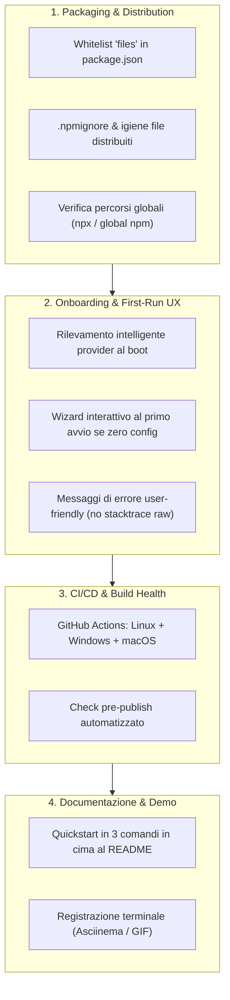

# TSUKA — Optimization & Release Readiness Plan (v0.2.0+)

> **Obiettivo**: Portare TSUKA da framework maturo in sviluppo locale a pacchetto open-source distribuibile, affidabile out-of-the-box e accattivante per la community, **senza tagliare le feature avanzate** ma **semplificando radicalmente l'onboarding e il primo avvio**.

---

## 1. Analisi Strategica: "Semplificare vs Pubblicare"

### 💡 Verdetto: Pubblicare preservando la complessità interna, semplificando la UX esterna.

- **Complessità interna (il valore del progetto)**:
  Meccanismi come il *Capability Fingerprinting* (`/benchmark`), il *Tool Pruning per Tier*, la *Blackboard di run isolata via AsyncLocalStorage*, il *Parallel Workspace staging con conflict detection* e i *Protocolli a tool-call resilienti* sono esattamente le feature che distinguono TSUKA dai semplici wrapper giocattolo. **Non vanno rimossi.**
- **Semplicità esterna (la porta d'ingresso)**:
  L'utente che installa `tsuka` con `npm i -g tsuka` o `npx tsuka` non deve incontrare errori di file mancanti, stacktrace di connessione a server locali spenti o configurazioni manuali complesse. Il primo minuto di utilizzo deve essere *zero-friction*.

---

## 2. Pilastri di Ottimizzazione

---

## 3. Dettaglio dei Task di Ottimizzazione

### Fase 6 — Release Readiness & Packaging Optimization

| ID | Titolo | Obiettivo | Priorità |
|---|---|---|---|
| **T11.1** | Packaging npm & Sanitizzazione Distribuzione | Whitelist esplicita `files` in `package.json`, `.npmignore`, pulizia artefatti locali e test packaging | **Alta** |
| **T11.2** | Zero-Config First Run & Wizard Onboarding | Boot resiliente se non c'è config o server locale: wizard interattivo e messaggi chiari | **Massima** |
| **T11.3** | GitHub Actions CI/CD Multi-Piattaforma | Workflow CI su push/PR per Windows, Ubuntu e macOS con Node 20/22 | **Alta** |
| **T11.4** | README Quickstart & Demo Ready | Quickstart in 3 comandi in cima al README (EN/IT) e rifinitura presentazione open-source | **Media** |

---

## 4. Criteri di Pronto al Rilascio (Release Checklist)

1. [ ] `npm pack --dry-run` mostra unicamente i file necessari (dist, preset, schemi, benchmark) e dimensione < 5MB.
2. [ ] `npx tsuka` eseguito in una cartella vuota su un sistema senza config guida l'utente senza crash.
3. [ ] `npm test` passa al 100% (45+ suite) su Windows, Linux e macOS in CI.
4. [ ] README principale e italiano presentano un Quickstart immediato prima di entrare nei dettagli architetturali.
